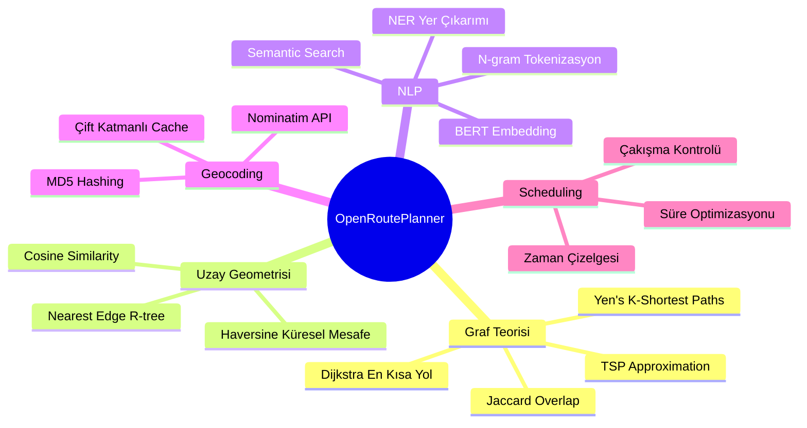
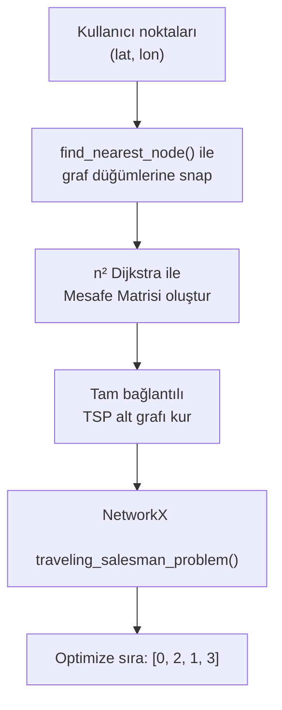
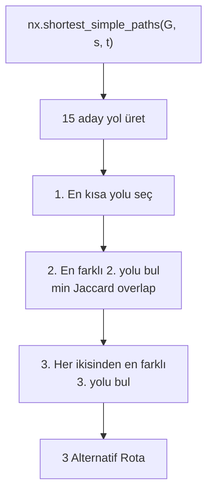
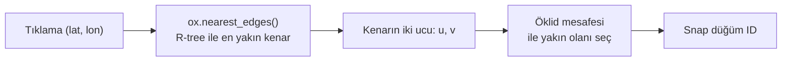
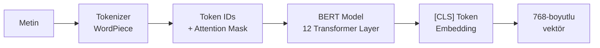
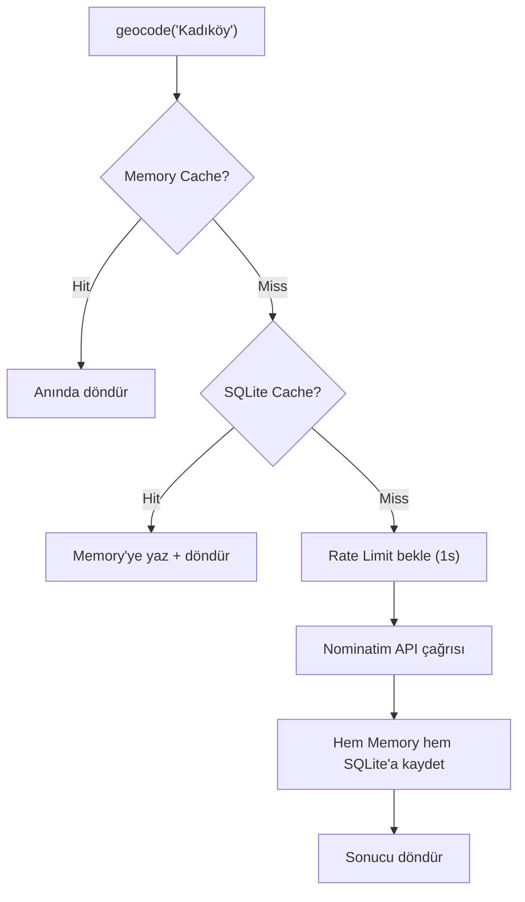
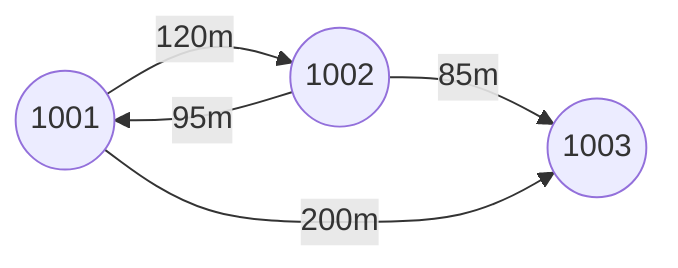

# OpenRoutePlanner — Algoritma ve Teknikler Raporu

Bu rapor, projenin **mevcut halinde** kullandığı tüm algoritmaları, matematiksel temelleri ve teknik detaylarıyla açıklamaktadır.

---

## 📋 Algoritma Haritası



---

## 1. Dijkstra'nın En Kısa Yol Algoritması

**Dosya:** [route_engine.py#L13-30](file:///c:/Users/abdul/Videos/Abd/okul/Graduation%20Project/Yeni%20klas%C3%B6r/OpenRoutePlanner/backend/route_engine.py#L13-L30)

### Ne Yapar?
İki düğüm (sokak kavşağı) arasındaki **en kısa mesafeli yolu** bulur.

### Matematiksel Temel

Verilen ağırlıklı graf G = (V, E), başlangıç düğümü s:

```
d(s) = 0
d(v) = ∞  (tüm diğer v ∈ V için)

Her adımda:
  u = min{d(v) : v ∈ Q}     ← Minimum mesafeli düğümü seç
  Her komşu v için:
    if d(u) + w(u,v) < d(v):
      d(v) = d(u) + w(u,v)   ← Relax işlemi
```

### Projede Kullanımı

```python
# route_engine.py, satır 26
path = nx.shortest_path(G, origin_node, dest_node, weight="length")
```

- **weight="length"** → kenar ağırlığı = metre cinsinden yol uzunluğu
- NetworkX bu fonksiyonda **binary heap** tabanlı priority queue kullanır
- **3 farklı yerde çağrılır:**
  1. İki nokta arası doğrudan rota
  2. TSP mesafe matrisi hesabı (n² kez)
  3. Alternatif rota fallback

### Karmaşıklık

| Metrik | Değer |
|---|---|
| **Zaman** | O((V + E) · log V) |
| **Bellek** | O(V) |
| **V** | ~10,000-50,000 (bir ilçenin sokak kavşak sayısı) |
| **E** | ~15,000-80,000 (sokak segmentleri) |

---

## 2. TSP Approximation (Gezgin Satıcı Problemi)

**Dosya:** [route_engine.py#L51-115](file:///c:/Users/abdul/Videos/Abd/okul/Graduation%20Project/Yeni%20klas%C3%B6r/OpenRoutePlanner/backend/route_engine.py#L51-L115)

### Ne Yapar?
N noktanın **en verimli ziyaret sırasını** bulur (toplam mesafeyi minimize et).

### Problem Tanımı

TSP **NP-hard** bir problemdir. N nokta için olası tur sayısı:

```
Olası permütasyon = (n-1)! / 2
  5 nokta → 12 tur
 10 nokta → 181,440 tur
 15 nokta → ~43 milyar tur
```

Optimal çözüm pratikte hesaplanamaz → **Yaklaşım algoritması** kullanılır.

### Projede Kullanılan Yaklaşım



**Adım adım:**

1. Her nokta → [find_nearest_node()](file:///c:/Users/abdul/Videos/Abd/okul/Graduation%20Project/OpenRoutePlanner/backend/graph_manager.py#94-125) ile en yakın graf düğümüne eşlenir
2. Her düğüm çifti arası Dijkstra ile mesafe hesaplanır → **O(n²)** Dijkstra çağrısı
3. Complete graph oluşturulur (tüm çiftler birbirine bağlı)
4. `traveling_salesman_problem(graph, cycle=False)` çağrılır

### İç Algoritma: Christofides / Greedy

NetworkX'in `traveling_salesman_problem()` fonksiyonu:

1. **Minimum Spanning Tree (MST)** oluştur
2. MST'deki **tek dereceli** düğümleri bul
3. Bu düğümler arası **minimum ağırlıklı tam eşleme** yap
4. MST + eşleme = **Euler Grafı** → Euler turu bul
5. Tekrar eden düğümleri atlayarak **Hamilton yolu** oluştur

**Garanti:** Optimal çözümün en fazla **1.5 katı** kadar uzun.

### Karmaşıklık

| Aşama | Karmaşıklık |
|---|---|
| Mesafe matrisi | O(n² · (V+E) log V) |
| TSP yaklaşımı | O(n³) |
| **Toplam** | **O(n² · (V+E) log V)** |

---

## 3. Yen's K-Shortest Paths Algoritması

**Dosya:** [route_engine.py#L202-363](file:///c:/Users/abdul/Videos/Abd/okul/Graduation%20Project/Yeni%20klas%C3%B6r/OpenRoutePlanner/backend/route_engine.py#L202-L363)

### Ne Yapar?
İki nokta arası **birden fazla farklı güzergah** oluşturur (En Kısa / En Hızlı / Dengeli).

### Algoritma



**Yen's algoritması** iteratif olarak çalışır:
1. İlk en kısa yol = Dijkstra
2. k-inci en kısa yol: önceki yolların kenarlarını geçici olarak kaldır → yeni Dijkstra çalıştır
3. Aday yollardan en kısasını seç

**Projede:** 15 aday yol üretilir, aralarından **en az overlap** olanlar seçilir.

### Jaccard Overlap (Rota Benzerlik Ölçüsü)

İki rota R₁ ve R₂ arasındaki benzerlik:

```
Jaccard(R₁, R₂) = |R₁ ∩ R₂| / |R₁ ∪ R₂|
```

```python
# route_engine.py, satır 225-233
def count_overlap(nodes1, nodes2):
    set1, set2 = set(nodes1), set(nodes2)
    intersection = len(set1 & set2)
    union = len(set1 | set2)
    return intersection / union
```

- 0 = tamamen farklı yollar
- 1 = tamamen aynı yol
- **2. rota:** 1. rota ile minimum overlap
- **3. rota:** Hem 1. hem 2. ile ortalama minimum overlap

---

## 4. Haversine Mesafe Formülü

**Dosya:** [graph_manager.py#L54-77](file:///c:/Users/abdul/Videos/Abd/okul/Graduation%20Project/Yeni%20klas%C3%B6r/OpenRoutePlanner/backend/graph_manager.py#L54-L77)

### Ne Yapar?
İki GPS koordinatı arasındaki **küresel (great-circle) mesafeyi** hesaplar.

### Matematiksel Formül

```
a = sin²(Δφ/2) + cos(φ₁) · cos(φ₂) · sin²(Δλ/2)
c = 2 · arcsin(√a)
d = R · c

R = 6,371,000 m (Dünya yarıçapı)
φ = enlem (radyan)
λ = boylam (radyan)
```

### Projede Kullanımı

[get_graph_for_points()](file:///c:/Users/abdul/Videos/Abd/okul/Graduation%20Project/OpenRoutePlanner/backend/graph_manager.py#43-92) fonksiyonunda, kullanıcının seçtiği noktaları kapsayan graf alanını belirler:

1. Tüm noktaların **merkez koordinatını** hesapla
2. Merkezden en uzak noktaya Haversine mesafesi hesapla
3. `radius = max(500m, mesafe + 300m)` → graf indirme yarıçapı

### Karmaşıklık
**O(n)** — n = nokta sayısı

---

## 5. Nearest Edge / R-tree Spatial Indexing

**Dosya:** [graph_manager.py#L94-124](file:///c:/Users/abdul/Videos/Abd/okul/Graduation%20Project/Yeni%20klas%C3%B6r/OpenRoutePlanner/backend/graph_manager.py#L94-L124)

### Ne Yapar?
Kullanıcının tıkladığı koordinatı en yakın **sokak segmentine** snap eder.

### Algoritma



1. **R-tree** (Rectangle tree): Uzaysal indeksleme yapısı. Tüm kenarları bounding box'lara ayırır ve ağaç yapısında organize eder
2. Sorgu noktasına en yakın kenarı (u, v) bulur → **O(log n)**
3. u ve v düğümlerinden hangisi daha yakınsa onu döndürür (Öklid mesafesi)

### Fallback
Hata durumunda `ox.nearest_nodes()` kullanılır (sadece düğüm bazlı, daha az hassas).

---

## 6. BERT (Bidirectional Encoder Representations from Transformers)

**Dosyalar:** [bert_engine.py](file:///c:/Users/abdul/Videos/Abd/okul/Graduation%20Project/Yeni%20klas%C3%B6r/OpenRoutePlanner/backend/bert_engine.py) + [bert_nlp_engine.py](file:///c:/Users/abdul/Videos/Abd/okul/Graduation%20Project/Yeni%20klas%C3%B6r/OpenRoutePlanner/backend/bert_nlp_engine.py)

### Ne Yapar?
Doğal dil sorgularını **anlam vektörlerine** çevirir ve **anlamsal benzerlik** ölçer.

### Model: `dbmdz/bert-base-turkish-uncased`

| Özellik | Değer |
|---|---|
| Parametre sayısı | ~110 milyon |
| Embedding boyutu | 768 |
| Max token | 128 |
| Disk boyutu | ~440 MB |
| RAM kullanımı | ~1.5 GB |

### BERT Encoding Süreci



1. **WordPiece Tokenization**: Metni alt-kelime parçalarına ayırır
   - "Kadıköy'den" → `["kad", "##ıköy", "##'den"]`
2. **Self-Attention**: Her token, diğer tüm tokenlarla ilişkisini hesaplar
3. **[CLS] token**: Tüm cümlenin anlamını temsil eden özet vektör
4. Çıktı: 768 boyutlu float vektör

### Projede 3 Temel Kullanım:

#### A) Sorgu Tipi Sınıflandırma (Semantic Search)

```python
# bert_nlp_engine.py, satır 422-459
def classify_query_type(self, query):
    query_embedding = self.bert.encode(query)
    
    for query_type, template_embs in template_embeddings.items():
        scores = [cosine_similarity(query_emb, t) for t in template_embs]
        avg_score = mean(scores)
```

Her sorgu tipi için **örnek cümleler** (template) tanımlıdır. Kullanıcı sorgusu bu template'lerle karşılaştırılır:

| Tip | Örnek Template |
|---|---|
| [route](file:///c:/Users/abdul/Videos/Abd/okul/Graduation%20Project/Yeni%20klas%C3%B6r/OpenRoutePlanner/backend/route_storage.py#124-144) | "Kadıköy'den Beşiktaş'a rota" |
| [poi](file:///c:/Users/abdul/Videos/Abd/okul/Graduation%20Project/OpenRoutePlanner/backend/graph_manager.py#127-196) | "Kadıköy'de neler var" |
| `multi` | "Kadıköy, Taksim ve Beşiktaş'ı gez" |
| `single` | "Taksim'e git" |

#### B) Yer İsmi Eşleştirme (Fuzzy / Typo Tolerant)

```
"kadikoy" → BERT embedding → cosine sim ile karşılaştır → "Kadıköy" (0.92)
"besiktas" → BERT embedding → cosine sim ile karşılaştır → "Beşiktaş" (0.89)
```

BERT, yazım hatalarına **toleranslıdır** çünkü kelimeyi karakter bazında değil anlam bazında temsil eder.

#### C) N-gram Yer Çıkarımı (NER)

```python
# bert_nlp_engine.py, satır 461-542
# 1. Tek kelimeler → threshold 0.75
# 2. 2-gram: "Taksim Meydanı" → threshold 0.65
# 3. 3-gram: "Bağdat Caddesi Kadıköy" → threshold 0.65
```

---

## 7. Cosine Similarity (Kosinüs Benzerliği)

**Kullanım yeri:** BERT embedding karşılaştırması, PlaceDatabase, sorgu sınıflandırma

### Formül

İki vektör **a** ve **b** arasındaki açısal benzerlik:

```
cos(θ) = (a · b) / (‖a‖ · ‖b‖)

     Σᵢ aᵢ·bᵢ
= ────────────────
  √(Σᵢ aᵢ²) · √(Σᵢ bᵢ²)
```

- **1.0** = tamamen aynı yön (aynı anlam)
- **0.0** = dik (ilişkisiz)
- **-1.0** = karşıt yön

### Projede Vektörize Hesaplama

```python
# bert_nlp_engine.py, satır 231-239
similarities = np.dot(embeddings, query_embedding)          # (n,)
norms = np.linalg.norm(embeddings, axis=1) * np.linalg.norm(query_embedding)
similarities = similarities / norms                         # normalize
```

NumPy ile **tüm yer isimleriyle** tek seferde hesaplanır → O(n · d), d=768.

---

## 8. Nominatim Geocoding (Yer İsmi ↔ Koordinat)

**Dosya:** [geocoder.py](file:///c:/Users/abdul/Videos/Abd/okul/Graduation%20Project/Yeni%20klas%C3%B6r/OpenRoutePlanner/backend/geocoder.py)

### Çift Katmanlı Cache Mimarisi



### MD5 Hashing (Cache Key)

```python
# geocoder.py, satır 96-98
def _query_hash(query):
    return hashlib.md5(query.encode("utf-8")).hexdigest()
```

Sorgu stringi → 32 karakterlik benzersiz hash → SQLite primary key olarak kullanılır.

### Rate Limiting

```python
# geocoder.py, satır 208-222
# Token bucket benzeri: son istekten bu yana geçen süre < 1s ise bekle
elapsed = current_time - _last_request_time
if elapsed < 1.0:
    time.sleep(1.0 - elapsed)
```

Nominatim kullanım şartı: **maksimum 1 istek/saniye**.

---

## 9. OSMnx Graf Oluşturma ve Cache

**Dosya:** [graph_manager.py](file:///c:/Users/abdul/Videos/Abd/okul/Graduation%20Project/Yeni%20klas%C3%B6r/OpenRoutePlanner/backend/graph_manager.py)

### Graf Veri Yapısı: MultiDiGraph



- **MultiDiGraph**: Yönlü, çoklu kenar destekli graf
- **Düğüm (node)**: Sokak kavşağı → `{id, x(lon), y(lat)}`
- **Kenar (edge)**: Sokak segmenti → `{length(m), highway, name, ...}`
- **Depolama**: `.graphml` (XML tabanlı, sıkıştırılmış graf formatı)

### Cache Stratejisi

| Yöntem | Key Format | Süre |
|---|---|---|
| Bölge adı ile | `kadikoy_istanbul_turkey.graphml` | Kalıcı (disk) |
| Koordinat ile | `point_40.9903_29.0291_800.graphml` | Kalıcı (disk) |
| Memory | Python dict | Uygulama ömrü |

---

## 10. Zaman Planlama Algoritması

**Dosya:** [time_planner.py](file:///c:/Users/abdul/Videos/Abd/okul/Graduation%20Project/Yeni%20klas%C3%B6r/OpenRoutePlanner/backend/time_planner.py)

### Sequencing (Sıralı Zaman Hesabı)

```mermaid
gantt
    title Rota Zaman Çizelgesi
    dateFormat HH:mm
    section Ziyaret
        Kadıköy: 09:00, 30min
        Yolculuk: 09:30, 15min
        Moda: 09:45, 30min
        Yolculuk: 10:15, 20min
        Beşiktaş: 10:35, 45min
```



### Seyahat Süresi Formülü

```
süre_dakika = (mesafe_km / hız_km_saat) × 60

Hızlar:
  Yürüyüş:  5 km/s  →  1 km = 12 dk
  Bisiklet: 15 km/s →  1 km =  4 dk
  Araç:     30 km/s →  1 km =  2 dk
```

### Çakışma Kontrolü

Her durak için mekanın açılış saatiyle karşılaştırır:

```
if varış_saati < açılış_saati OR varış_saati > kapanış_saati:
    → "Bu saat kapalı olabilir" uyarısı
```

### Süre Optimizasyonu

- `max_duration_minutes` aşılırsa → ziyaret süresi azaltma önerisi
- `preferred_end_time` geçilirse → erken başlama önerisi
- Tek noktada >120 dk → "çok uzun" uyarısı

---

## 11. Rota Kayıt ve Veri Sıkıştırma

**Dosya:** [route_storage.py](file:///c:/Users/abdul/Videos/Abd/okul/Graduation%20Project/Yeni%20klas%C3%B6r/OpenRoutePlanner/backend/route_storage.py)

### Koordinat Sıkıştırma (Downsampling)

```python
# route_storage.py, satır 52-66
def simplify_coords(coords, tolerance=3):
    # Her 3 noktadan 1'ini al + ilk ve son noktayı koru
    simplified = [coords[0]]
    for i in range(tolerance, len(coords)-1, tolerance):
        simplified.append(coords[i])
    simplified.append(coords[-1])
    return simplified
```

Bir rota 500+ koordinat içerebilir. Kayıt boyutunu küçültmek için her N noktadan birini alır.

---

## 📊 Tüm Algoritmalar — Özet Tablosu

| # | Algoritma | Dosya | Karmaşıklık | Kullanım Amacı |
|---|---|---|---|---|
| 1 | **Dijkstra** | [route_engine.py](file:///c:/Users/abdul/Videos/Abd/okul/Graduation%20Project/OpenRoutePlanner/backend/route_engine.py) | O((V+E) log V) | En kısa yol |
| 2 | **TSP Approximation** | [route_engine.py](file:///c:/Users/abdul/Videos/Abd/okul/Graduation%20Project/OpenRoutePlanner/backend/route_engine.py) | O(n² · (V+E) log V) | Optimum ziyaret sırası |
| 3 | **Yen's K-Shortest** | [route_engine.py](file:///c:/Users/abdul/Videos/Abd/okul/Graduation%20Project/OpenRoutePlanner/backend/route_engine.py) | O(K · V · (V+E) log V) | Alternatif güzergahlar |
| 4 | **Jaccard Overlap** | [route_engine.py](file:///c:/Users/abdul/Videos/Abd/okul/Graduation%20Project/OpenRoutePlanner/backend/route_engine.py) | O(n) | Rota farklılık ölçümü |
| 5 | **Haversine** | [graph_manager.py](file:///c:/Users/abdul/Videos/Abd/okul/Graduation%20Project/OpenRoutePlanner/backend/graph_manager.py) | O(n) | GPS koordinat mesafesi |
| 6 | **R-tree / Nearest Edge** | [graph_manager.py](file:///c:/Users/abdul/Videos/Abd/okul/Graduation%20Project/OpenRoutePlanner/backend/graph_manager.py) | O(log n) | Koordinat → sokak snap |
| 7 | **BERT Encoding** | [bert_engine.py](file:///c:/Users/abdul/Videos/Abd/okul/Graduation%20Project/Yeni%20klas%C3%B6r/OpenRoutePlanner/backend/bert_engine.py) | O(L² · d) | Metin → vektör |
| 8 | **Cosine Similarity** | [bert_nlp_engine.py](file:///c:/Users/abdul/Videos/Abd/okul/Graduation%20Project/Yeni%20klas%C3%B6r/OpenRoutePlanner/backend/bert_nlp_engine.py) | O(n · d) | Anlamsal benzerlik |
| 9 | **N-gram Tokenization** | [bert_nlp_engine.py](file:///c:/Users/abdul/Videos/Abd/okul/Graduation%20Project/Yeni%20klas%C3%B6r/OpenRoutePlanner/backend/bert_nlp_engine.py) | O(w²) | Yer ismi çıkarımı |
| 10 | **MD5 Hashing** | [geocoder.py](file:///c:/Users/abdul/Videos/Abd/okul/Graduation%20Project/Yeni%20klas%C3%B6r/OpenRoutePlanner/backend/geocoder.py) | O(1) | Cache key üretimi |
| 11 | **Rate Limiting** | [geocoder.py](file:///c:/Users/abdul/Videos/Abd/okul/Graduation%20Project/Yeni%20klas%C3%B6r/OpenRoutePlanner/backend/geocoder.py) | O(1) | API kullanım sınırı |
| 12 | **Zaman Scheduling** | [time_planner.py](file:///c:/Users/abdul/Videos/Abd/okul/Graduation%20Project/Yeni%20klas%C3%B6r/OpenRoutePlanner/backend/time_planner.py) | O(n) | Zaman çizelgesi |
| 13 | **Coord. Downsampling** | [route_storage.py](file:///c:/Users/abdul/Videos/Abd/okul/Graduation%20Project/Yeni%20klas%C3%B6r/OpenRoutePlanner/backend/route_storage.py) | O(n) | Veri sıkıştırma |

> **n** = nokta/yer sayısı, **V** = graf düğüm sayısı, **E** = kenar sayısı, **L** = token uzunluğu, **d** = embedding boyutu (768), **w** = kelime sayısı
