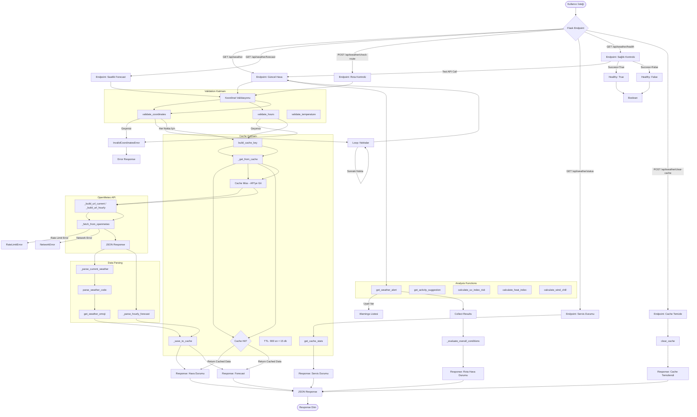
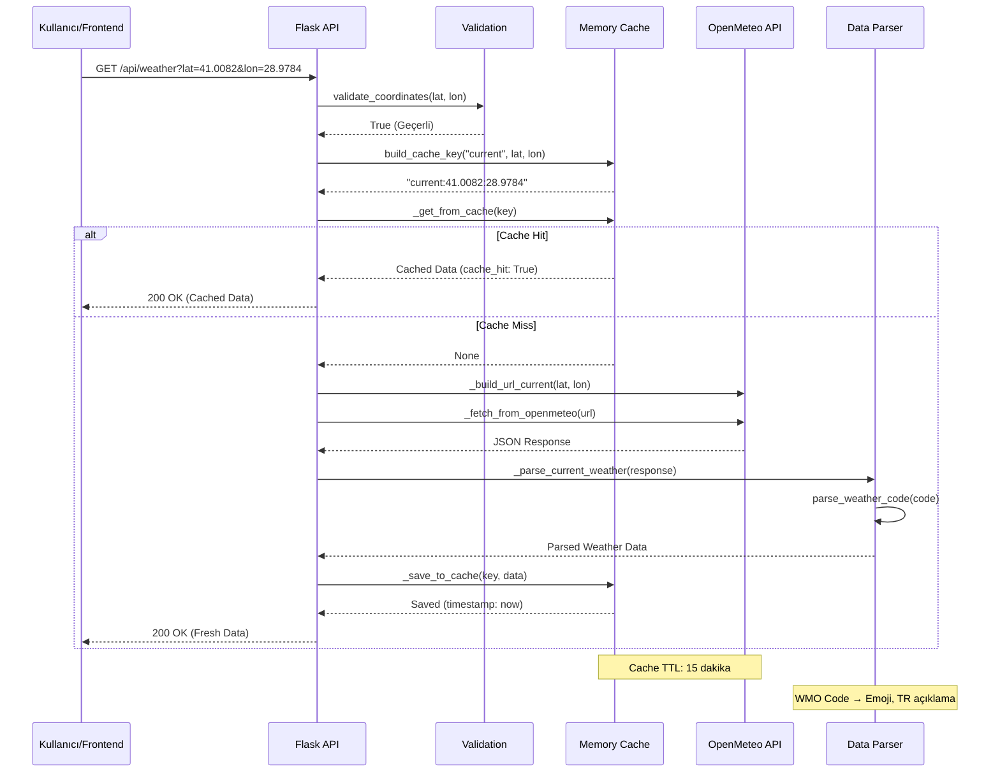
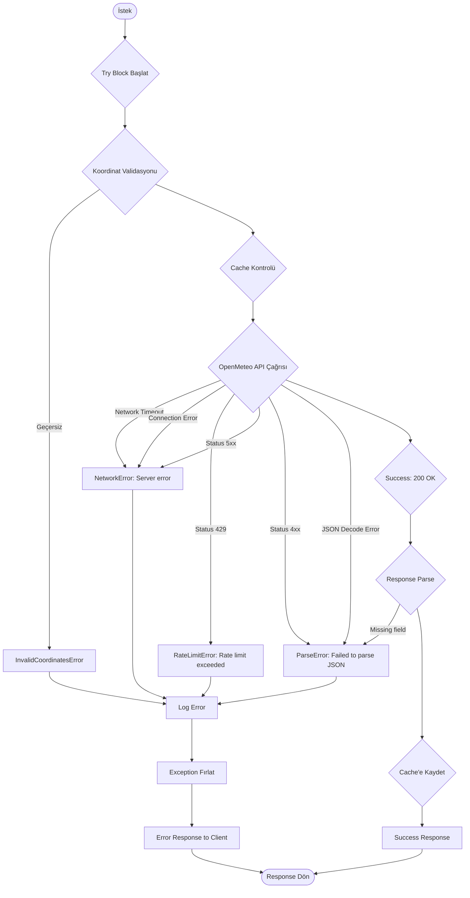
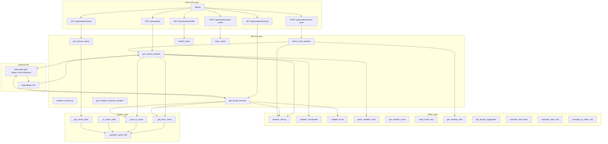
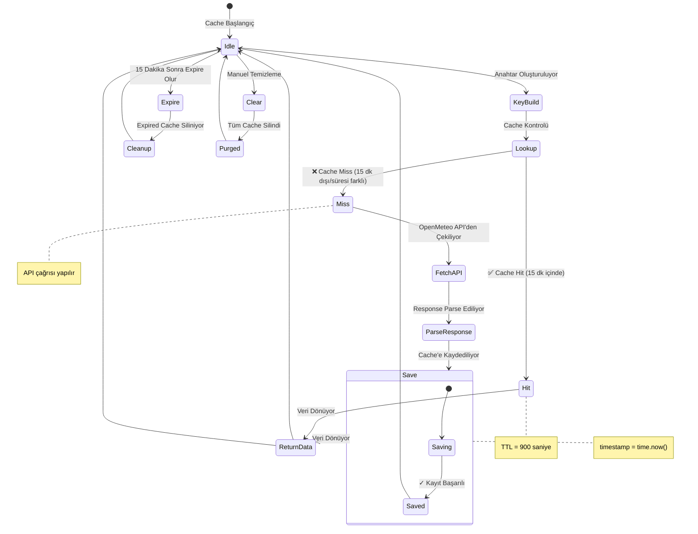

# Hava Durumu Servisi - Akış Diyagramı

## Genel Akış Diyagramı



## Cache Mekanizması Detaylı Diyagramı



## get_current_weather Fonksiyonu Detaylı Akışı

```mermaid
flowchart TD
    START([get_current_weather çağrısı]) --> INPUT{lat, lon, use_cache=True}

    INPUT --> VALIDATE{Koordinat Validasyonu}
    VALIDATE --> |lat: -90 to 90| CHECK_LAT{Geçerli aralıkta mi?}
    VALIDATE --> |lon: -180 to 180| CHECK_LON{Geçerli aralıkta mi?}

    CHECK_LAT --> |Hayır| INVALID[InvalidCoordinatesError]
    CHECK_LON --> |Hayır| INVALID

    CHECK_LAT --> |Evet| BUILD_KEY
    CHECK_LON --> |Evet| BUILD_KEY{build_cache_key}

    BUILD_KEY --> CACHE_LOOKUP{_get_from_cache}
    CACHE_LOOKUP --> CACHE_DECISION{Cache'te var mi?}

    CACHE_DECISION -->|Evet| CACHE_HIT[✅ Cache HIT]
    CACHE_DECISION -->|Hayır| CACHE_MISS[❌ Cache MISS]

    CACHE_HIT --> RETURN_CACHE{cache_hit: True}
    RETURN_CACHE --> OUTPUT

    CACHE_MISS --> BUILD_URL{_build_url_current}
    BUILD_URL --> FETCH{_fetch_from_openmeteo}

    FETCH --> |Network Error| NET_ERR[NetworkError]
    FETCH --> |Rate Limit| RATE_ERR[RateLimitError]
    FETCH --> |Status ≠ 200| API_ERR[ParseError]
    FETCH --> |Success| RESPONSE[JSON Response]

    RESPONSE --> PARSE{_parse_current_weather}
    PARSE --> EXTRACT{temperature, humidity, weather_code, vb.}
    EXTRACT --> CONVERT{WMO code → TR açıklama, emoji}
    CONVERT --> SAVE_CACHE{_save_to_cache}

    SAVE_CACHE --> RETURN_FRESH{cache_hit: False}
    RETURN_FRESH --> OUTPUT

    OUTPUT --> SUCCESS[{"success": true, "data": {...}}]

    NET_ERR --> ERROR_RESPONSE
    RATE_ERR --> ERROR_RESPONSE
    API_ERR --> ERROR_RESPONSE
    INVALID --> ERROR_RESPONSE

    ERROR_RESPONSE --> END([Error Response])
    SUCCESS --> END
```

## check_route_weather Fonksiyonu Akışı

```mermaid
flowchart TD
    START([check_route_weather çağrısı]) --> INPUT{points: [{lat, lon, name}, ...]}

    INPUT --> CHECK_EMPTY{Nokta var mı?}
    CHECK_EMPTY --> |Hayır| VALUE_ERR[ValueError: En az 1 nokta]

    CHECK_EMPTY --> |Evet| INIT_LOOP{Her nokta için}
    INIT_LOOP --> GET_POINT{Noktayı al}

    GET_POINT --> EXTRACT_COORD{lat, lon çıkar}
    EXTRACT_COORD --> CHECK_COORD{Koordinat var mı?}

    CHECK_COORD --> |Hayır| ADD_ERROR{Hata ekle}
    CHECK_COORD --> |Evet| GET_WEATHER{get_current_weather}

    GET_WEATHER --> PARSE_DATA{current data}
    PARSE_DATA --> CHECK_ALERT{get_weather_alert}

    CHECK_ALERT --> |Uyari var| ADD_WARN{warnings listesine ekle}
    CHECK_ALERT --> |Uyari yok| ADD_RESULT{route_weather listesine ekle}

    ADD_WARN --> ADD_RESULT
    ADD_ERROR --> NEXT_POINT{Sonraki nokta}
    ADD_RESULT --> NEXT_POINT

    NEXT_POINT --> MORE_POINTS{Daha fazla nokta var mı?}
    MORE_POINTS --> |Evet| GET_POINT

    MORE_POINTS --> |Hayır| EVALUATE{_evaluate_overall_conditions}

    EVALUATE --> ANALYZE_CODES{Tum weather kodlarını topla}
    ANALYZE_CODES --> FIND_MAX{En yüksek kodu bul}

    FIND_MAX --> CATEGORIZE{Kategori belirle}
    CATEGORIZE --> |max ≤ 3| CLEAR[clear]
    CATEGORIZE --> |max ≤ 48| FOGGY[foggy]
    CATEGORIZE --> |max ≤ 82| RAINY[rainy]
    CATEGORIZE --> |max ≤ 86| SNOWY[snowy]
    CATEGORIZE --> |max > 86| STORMY[stormy]

    CLEAR --> OUTPUT
    FOGGY --> OUTPUT
    RAINY --> OUTPUT
    SNOWY --> OUTPUT
    STORMY --> OUTPUT

    OUTPUT --> SUCCESS[{"success": true, "data": {...}}]
    VALUE_ERR --> ERROR

    SUCCESS --> END
    ERROR --> END
```

## Data Yapıları ve Format Dönüşümleri

```mermaid
graph LR
    subgraph OpenMeteo API Response
        API1[["current": {...}]]
        API2[["hourly": {...}]]
    end

    subgraph Parsing
        P1[_parse_current_weather]
        P2[_parse_hourly_forecast]
    end

    subgraph WMO Code Processing
        WMO1[WMO Code: 0-99]
        WMO2[parse_weather_code]
    end

    subgraph Enhanced Data
        E1[description: "Clear sky"]
        E2[tr: "Acik gokyuzu"]
        E3[icon: "sun"]
        E4[category: "clear"]
        E5[emoji: "☀️"]
    end

    subgraph Final Response
        R1[{"success": true}]
        R2[{"data": {"location": {...}}}]
        R3[{"current": {...}}]
        R4[{"hourly": {...}}]
    end

    API1 --> P1
    API2 --> P2
    WMO1 --> WMO2
    WMO2 --> E1
    WMO2 --> E2
    WMO2 --> E3
    WMO2 --> E4
    WMO2 --> E5
    E1 --> R3
    E2 --> R3
    E5 --> R3
    P1 --> R1
    P2 --> R1
    R1 --> R2
```

## Hata Yakalama Akışı



## Component Mimari Diyagramı



## Cache Lifecycle



## Saatlik Forecast Akışı

```mermaid
flowchart TD
    START([get_hourly_forecast]) --> INPUT{lat, lon, hours=24, use_cache=True}

    INPUT --> VALIDATE1{validate_coordinates}
    VALIDATE1 --> |Geçersiz| INVALID_COORD

    VALIDATE1 --> VALIDATE2{validate_hours: 1-168}
    VALIDATE2 --> |Geçersiz| INVALID_HOURS

    VALIDATE2 --> BUILD_KEY{build_cache_key: "hourly", hours}
    BUILD_KEY --> CACHE_LOOKUP

    CACHE_LOOKUP --> HIT{✅ Cache Hit}
    CACHE_LOOKUP --> MISS{❌ Cache Miss}

    HIT --> RETURN_CACHED{cache_hit: True}
    RETURN_CACHED --> OUTPUT

    MISS --> BUILD_URL{_build_url_hourly}
    BUILD_URL --> API_CALL{_fetch_from_openmeteo}
    API_CALL --> API_RESP{JSON Response}

    API_RESP --> PARSE{_parse_hourly_forecast}
    PARSE --> EXTRACT{time[], temperature[], precipitation[], ...}
    EXTRACT --> SAVE_CACHE

    SAVE_CACHE --> RETURN_FRESH{cache_hit: False}
    RETURN_FRESH --> OUTPUT

    OUTPUT --> SUCCESS[{"success": true, "data": {"hourly": {...}}}]
    INVALID_COORD --> ERROR[InvalidCoordinatesError]
    INVALID_HOURS --> ERROR[ValueError]

    ERROR --> END
    SUCCESS --> END
```

## WMO Code Processing Pipeline

```mermaid
flowchart LR
    CODE[WMO Weather Code<br/>0-99 Tam Sayı] --> PARSE[parse_weather_code]

    subgraph "WMO_WEATHER_CODES Lookup"
        DICT[WMO_WEATHER_CODES<br/>46 Kod Map]
    end

    PARSE --> DICT
    DICT --> |Kod var mi?| CHECK{Kontrol}

    CHECK -->|Evet| EXTRACT{Bilgileri Çıkar}
    CHECK -->|Hayır| DEFAULT{Unknown Varsayılan}

    EXTRACT --> SPLIT{4 Bilgi Çıkar}
    SPLIT --> D1[description: "Clear sky"]
    SPLIT --> D2[tr: "Acik gokyuzu"]
    SPLIT --> D3[icon: "sun"]
    SPLIT --> D4[category: "clear"]

    D1 --> EMOJI[get_weather_emoji]
    D4 --> COLOR[get_weather_color_code]
    D4 --> CSS[get_weather_background_class]

    EMOJI --> E_OUT["☀️"]
    COLOR --> C_OUT["#FFD700"]
    CSS --> CSS_OUT["weather-clear"]

    DEFAULT --> D_OUT1[description: "Unknown"]
    DEFAULT --> T_OUT[tr: "Bilinmiyor"]
    DEFAULT --> I_OUT[icon: "question"]
    DEFAULT --> CAT_OUT[category: "unknown"]

    D_OUT1 --> EMOJI
    T_OUT --> EMOJI
    I_OUT --> EMOJI
    CAT_OUT --> COLOR
    CAT_OUT --> CSS
```

Bu diyagramlar hava durumu servisinin tüm akışını görsel olarak temsil etmektedir. Her biri farklı bir açıdan servisi gösterir:
1. **Genel Akış**: Tüm endpoint'ler ve veri akışı
2. **Cache Mekanizması**: Memory cache çalışma prensibi
3. **get_current_weather**: En çok kullanılan fonksiyon
4. **check_route_weather**: Rta bazlı hava kontrolü
5. **Hata Yakalama**: Exception handling
6. **Component Mimari**: Katmanlı yapı
7. **Cache Lifecycle**: Cache yaşam döngüsü
8. **Saatlik Forecast**: Forecast akışı
9. **WMO Code Processing**: Kod dönüşüm pipeline'ı
