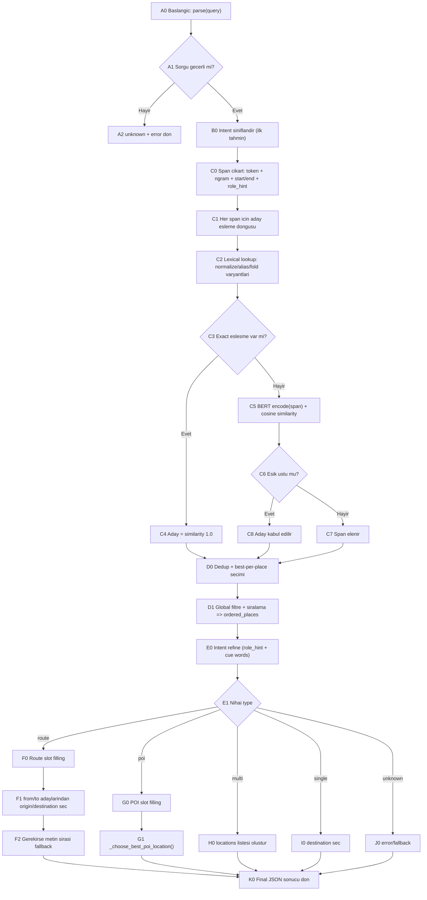
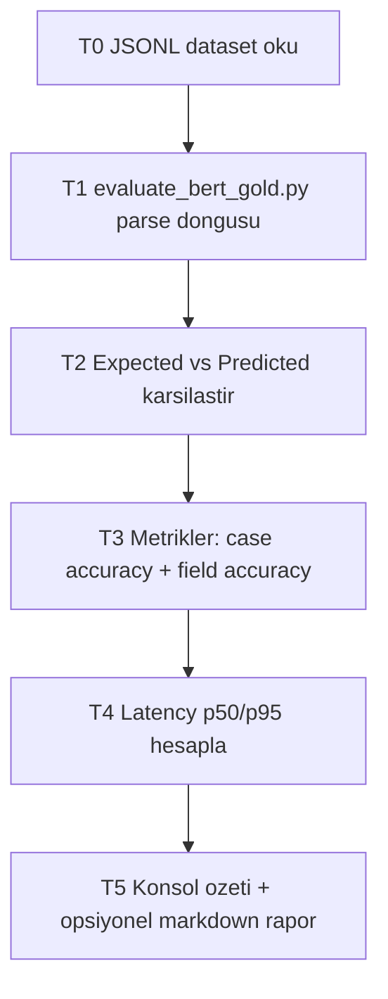

# BERT Calisma Akis Semasi (Detayli)

Bu dokuman, mevcut BERT NLP akisini kutu kutu aciklar.
Amac: "hangi adim ne yapiyor?" sorusuna net cevap vermek.

## 1) Calisma Akisi (Runtime Parse)

## 2) Kutu Aciklamalari (Parse)

| Kutu | Ne yapiyor | Girdi | Cikti |
|---|---|---|---|
| A0 | Ana parse fonksiyonu baslar | query (str) | islem akisi |
| A1 | Bos/gecersiz sorgu kontrolu | query | true/false |
| A2 | Hata cevabi | gecersiz query | type=unknown, error |
| B0 | Ilk intent tahmini | query | route/poi/multi/single/unknown + confidence |
| C0 | Mention/span adayi cikarir | normalize query | span listesi (surface, normalized, start, end, role_hint) |
| C1 | Her span icin aday arama dongusu | span listesi | adaylar |
| C2 | Dogrudan isim eslesmesi arar | normalized span | canonical place adayi |
| C3 | Exact eslesme karari | lookup sonucu | var/yok |
| C4 | Exact bulunursa en yuksek guvenle adaya cevirir | place | similarity=1.0 aday |
| C5 | Exact yoksa semantic eslesme yapar | span embedding + place embeddings | similarity skorlari |
| C6 | Skor esik kontrolu | similarity | kabul/red |
| C7 | Dusuk skor span'i atar | span | elenmis |
| C8 | Yuksek skor span'i adaya ekler | span + match | kabul edilmis aday |
| D0 | Ayni place icin en iyi adayi tutar | adaylar | dedup adaylar |
| D1 | Filtre + siralama yapar | dedup adaylar | ordered_places |
| E0 | Intent'i kurallarla rafine eder | ilk intent + role_hint + cue words | nihai intent |
| E1 | Nihai tip secimi | refine sonucu | route/poi/multi/single/unknown |
| F0 | Route slot asamasi | ordered_places | route alanlari |
| F1 | from/to sinyallerinden yon atar | role_hint + similarity | origin/destination |
| F2 | Yon cikmazsa metin sirasi fallback | ordered_places | origin/destination tamam |
| G0 | POI slot asamasi | ordered_places | location |
| G1 | POI lokasyonu secme fonksiyonu | ordered_places | en iyi location |
| H0 | Coklu gezi listesi doldurma | ordered_places | locations[] |
| I0 | Tek hedef secimi | ordered_places | destination |
| J0 | Hata/fallback | yetersiz sinyal | unknown/error |
| K0 | Ciktiyi JSON olarak doner | tum alanlar | final result |

## 3) _choose_best_poi_location() Ic Mantigi

1. Exact eslesen aday varsa (similarity 1.0), onu sec.
2. Exact yoksa role_hint=loc adaylarini degerlendir.
3. Hala yoksa en yuksek similarity adayi sec.

Bu siralama, "Taksim civarinda muze var mi?" gibi sorgularda
genel semantik benzer ama alakasiz yerlerin one gecmesini azaltir.

## 4) Intent Refine Kurallari (Ozet)

1. `from/to` sinyali gucluyse `route`.
2. POI cue kelimeleri varsa ve yon sinyali yoksa `poi`.
3. 3+ yer + multi cue varsa `multi`.
4. Tek hedef sinyali varsa `single`.
5. Hicbiri degilse `unknown`/fallback.

## 5) Degerlendirme (Gold Benchmark) Akisi

## 6) Neden Bu Mimari?

- Sadece regex'e bagli degil, retrieval + semantic + slot karar katmani var.
- Exact lexical adim sayesinde yer adlarinda yanlis semantic eslesme azalir.
- Intent refine katmani, tek model skorunun yanlis tip secmesini dengeler.
- Benchmark scripti ile degisiklikten sonra kalite/regresyon olculur.

