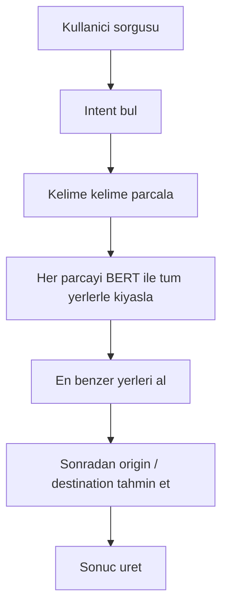
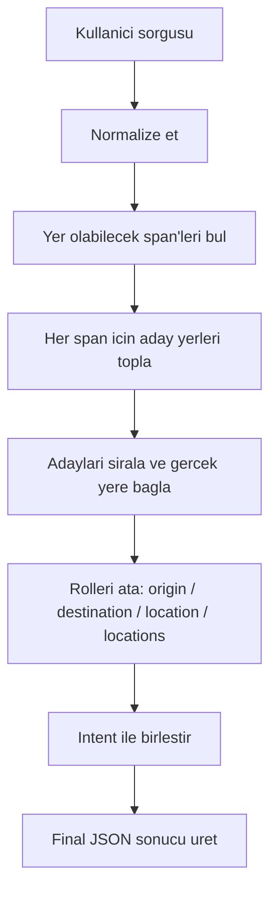

# BERT Gelistirme Akisi

Bu dokuman, BERT tarafini nasil gelistirecegimizi ve mevcut yaklasimdan hedef mimariye nasil gececegimizi kisa ve net sekilde anlatir.

## Hedef

Regex ana cozum olmasin.
Regex en fazla dar bir fallback ve birkac yuksek-precision ipucu olarak kalsin.

Ana cozum su olsun:

1. Sorguyu normalize et
2. Metindeki yer olabilecek span'leri bul
3. Bu span'ler icin aday yerleri topla
4. En dogru gercek yeri sec
5. Origin / destination / location rollerini ata
6. Intent ile birlestir
7. Final sonucu uret

---

## Mevcut Sistem



### Mevcut sistemin sorunu

- Yer cikarma ile yer baglama birbirine karisiyor
- Apostroflu Turkce ekler token'lari bozabiliyor
- Benzerlik sirasi bazen metin sirasini bozuyor
- Origin / destination karari gec veriliyor
- Canli OSM sorgusu parse kritik yoluna fazla gomuluyor

---

## Hedef Sistem



---

## Ana Fikir

Yeni yapida sistem su mantikla calisir:

- Once metni temizler ve normalize eder
- Sonra metin icindeki yer olabilecek parcalari isaretler
- Sonra bu parcalar icin aday yerleri arar
- Sonra bu adaylar arasindan dogru gercek yeri secer
- Sonra bu yerlerin rolde ne olduguna karar verir

Yani:

Parser mantigindan

-> NLP + retrieval + linking mantigina

geciyoruz.

---

## Ornek 1: Route Sorgusu

Girdi:

```text
Kadikoy'den Besiktas'a rota ciz
```

### 1. Normalize

```json
{
  "text": "kadikoy'den besiktas'a rota ciz"
}
```

### 2. Mention Detection

```json
[
  {"surface":"kadikoy'den","normalized":"kadikoy","role_hint":"from"},
  {"surface":"besiktas'a","normalized":"besiktas","role_hint":"to"}
]
```

### 3. Candidate Retrieval

```json
[
  {
    "mention":"kadikoy",
    "candidates":[
      "Kadikoy, Istanbul",
      "Kadikoy Iskele",
      "Kadikoy Moda"
    ]
  },
  {
    "mention":"besiktas",
    "candidates":[
      "Besiktas, Istanbul",
      "Besiktas Meydan",
      "Besiktas Iskele"
    ]
  }
]
```

### 4. Place Linking

```json
[
  {"mention":"kadikoy","resolved":"Kadikoy, Istanbul","score":0.94},
  {"mention":"besiktas","resolved":"Besiktas, Istanbul","score":0.96}
]
```

### 5. Slot Filling

```json
{
  "origin":"Kadikoy, Istanbul",
  "destination":"Besiktas, Istanbul"
}
```

### 6. Final Result

```json
{
  "type":"route",
  "origin":"Kadikoy",
  "destination":"Besiktas",
  "confidence":0.93
}
```

---

## Ornek 2: POI Sorgusu

Girdi:

```text
Kadikoy'de neler var
```

### Adimlar

```json
{
  "mention":"kadikoy",
  "role_hint":"loc",
  "linked_place":"Kadikoy, Istanbul",
  "type":"poi",
  "location":"Kadikoy"
}
```

Yani burada:

- `from` veya `to` degil
- `loc` oldugu icin origin / destination beklemiyoruz
- intent `poi`

---

## Yeni Moduller

Ilk asamada bunlari ayri dosya yapmak zorunda degiliz.
Once mevcut `backend/bert_nlp_engine.py` icinde fonksiyon olarak kurariz.
Stabil olduktan sonra ayri modullere ayiririz.

Planlanan mantik:

1. `normalize_query_text()`
2. `detect_place_mentions()`
3. `retrieve_place_candidates()`
4. `link_places()`
5. `assign_slots()`
6. `classify_intent()`
7. `build_result()`

---

## Kisa Gorev Tanimlari

### 1. Query Normalizer

Ne yapar:

- apostrof varyasyonlarini duzeltir
- temel alias duzeltmeleri yapar
- Turkce ekler icin rol ipucu cikarir
- metni tek bir standart forma getirir

Ornek:

- `kadikoy` -> `kadikoy`
- `kadikoy'den` -> `kadikoy + from`
- `besiktas'a` -> `besiktas + to`

### 2. Mention Detector

Ne yapar:

- metindeki yer olabilecek span'leri bulur
- `start / end / surface / normalized / role_hint` saklar

Ornek:

```json
{
  "surface":"Taksim Meydani'na",
  "normalized":"taksim meydani",
  "role_hint":"to",
  "start":0,
  "end":17
}
```

### 3. Place Retriever

Ne yapar:

- span icin aday yerleri toplar

Kaynaklar:

- local cache
- user locations
- dynamic OSM cache
- gerekirse canli OSM

Onemli not:

BERT ilk arama motoru olmayacak.
Once adaylar toplanacak, sonra BERT rerank icin kullanilacak.

### 4. Place Linker

Ne yapar:

- adaylar arasindan en dogru gercek yeri secer

Bakilan sinyaller:

- lexical eslesme
- alias eslesme
- semantic score
- source bonus
- span uzunlugu
- context

### 5. Slot Filler

Ne yapar:

- linked yerleri role donusturur

Kurallar:

- `-den / -dan / -ten / -tan` -> `origin`
- `-e / -a / -ye / -ya` -> `destination`
- `-de / -da / -te / -ta` -> `location`
- virgul + `ve` -> `locations`

Ama ana fikir su:

Role kararini similarity sirasi degil,

- metin pozisyonu
- role hint
- intent

belirleyecek.

---

## Uygulama Sirasi

### Asama 1

Mevcut dosyada altyapiyi kur:

1. `normalize_query_text`
2. `detect_place_mentions`
3. `assign_slots`
4. `parse()` icinde yeni akisi bagla

### Asama 2

Retrieval ve linking'i ayir:

1. `retrieve_place_candidates`
2. `link_places`
3. OSM cagri sayisini azalt
4. local cache'i guclendir

### Asama 3

Intent tarafini guclendir:

1. `classify_query_type()` iyilestir
2. confidence hesaplamasini yeniden kur
3. gerekirse ayri model kullan

---

## En Kisa Ozet

Yeni sistemin akisi su olacak:

```text
Sorgu
-> normalize
-> yer olabilecek span'leri bul
-> bu span'ler icin aday yer topla
-> en dogru yere bagla
-> origin / destination / location rollerini ata
-> intent ile birlestir
-> sonucu don
```

Bu gecisle birlikte sistem:

- regex-first olmaktan cikar
- open-world place retrieval mantigina gecer
- yeni yer isimlerine ve canli OSM verisine daha iyi uyum saglar
- origin / destination hatalarini azaltir

